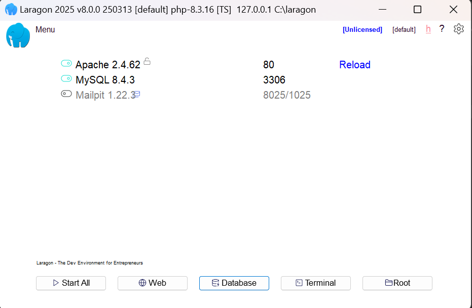

# Project Documentation

## 1. Project Overview
This project is a React application designed for managing invoices. It allows users to create, edit, and print invoices, as well as manage client information.

## 2. Installation
### Prerequisites
- Node.js
- npm

### Steps to Clone the Repository
```bash
git clone <repository-url>
cd <repository-directory>
```

### Instructions to Install Dependencies
```bash
npm install
```

## 3. Project Structure
- Overview of the directory structure
  - `src/`: Contains all source code
    - `components/`: Reusable components
      - `Invoice.js`: Main component for creating and managing invoices. It handles client details, invoice items, and printing functionality.
      - `TableForm.js`: Form for adding and editing invoice items. It validates input and manages the item list.
      - `ClientDetails.js`: Component for entering client information.
      - `Dates.js`: Component for managing invoice dates.
      - `Header.js`: Navigation component for the application.
      - `Footer.js`: Footer component for the application layout.
      - `Notes.js`: Component for displaying additional notes related to the invoice.
      - `DeleteModal.js`: Modal for confirming deletions of invoice items.
      - `MainDetails.js`: Component for displaying main invoice details.
      - `Table.js`: Component for displaying a table of invoice items.
    - `context/`: Context API for state management
      - `stateContext.js`: Manages global state for the application, including client and invoice data.
      - `auth.js`: Handles authentication logic for the application.
    - `pages/`: Different pages of the application
    - `data/`: Static data files
    - `images/`: Image assets
  - `public/`: Static files served by the application
  - `README.md`: Project documentation


## 4. Components
### Invoice
- **Description**: Main component for creating and managing invoices. It handles client details, invoice items, and printing functionality.
- **Data Handling**: Fetches client and invoice data from the API and updates the global state with the created invoice.

### TableForm
- **Description**: Form for adding and editing invoice items. It validates input and manages the item list.
- **Data Handling**: Updates the global state with new items and calculates totals based on user input.

### ClientDetails
- **Description**: Component for entering client information.
- **Data Handling**: Captures client data and updates the global state.

### Dates
- **Description**: Component for managing invoice dates.
- **Data Handling**: Updates the global state with invoice date information.

### Header/Footer
- **Description**: Navigation and footer components for the application layout.
- **Data Handling**: No direct data handling; primarily for UI structure.

### Notes
- **Description**: Component for displaying additional notes related to the invoice.
- **Data Handling**: Updates the global state with notes entered by the user.

### DeleteModal
- **Description**: Modal for confirming deletions of invoice items.
- **Data Handling**: Interacts with the global state to remove items from the invoice.

### MainDetails
- **Description**: Component for displaying main invoice details.
- **Data Handling**: Retrieves and displays data from the global state.

### Table
- **Description**: Component for displaying a table of invoice items.
- **Data Handling**: Pulls item data from the global state for rendering.

## 5. State Management
The application uses the Context API for state management. The `stateContext.js` file contains state variables for managing client and invoice data.

## 6. API Integration
### Overview of API Endpoints
- `/api/invoices`: Endpoint for creating invoices
invoice items

## 7. Usage
### Instructions to Run the Application
```bash
npm start
```

### User Interface Description
The application features a user-friendly interface for managing invoices and client information.

## 8. Contributing
Contributions are welcome! Please follow the guidelines for contributing to the project.


## 9. How to Start the project
-> Start server system before running the application

```bash
run the laragon application on your system
-> start the Apache 2.4.62 
-> start the mysql 8.4.3
```


-> Route to the backend directory to run your server
```bash
cd Backend
npm start
```

-> Route to the invoice app to run your frontend app
``` bash
cd Invoicer_v2-main
npm start 
```

## 10. Created By
A. Martin , 2025
